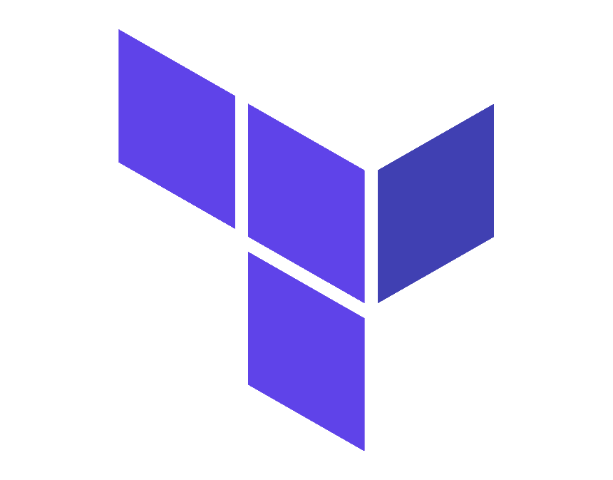

#### Scripting and Automation.
{: style="width:100px"} [Terraform Documentation](/devops/terraform/intro)

terraform is currently the leading devops provider. 

{: style="width:100px"} [Ansible Documentation](/devops/ansible/intro)

ansible is currently the leading devops provider. 

{: style="width:150px"} [Docker Documentation](/devops/docker/intro)

docker is currently the leading devops provider. 

{: style="width:100px"} [Kubernetes Documentation](/devops/kubernetes/intro)

kubernetes is currently the leading devops provider. 

{: style="width:100px"} [Web Services Documentation](/devops/webservices/intro)

python is currently the leading devops provider.